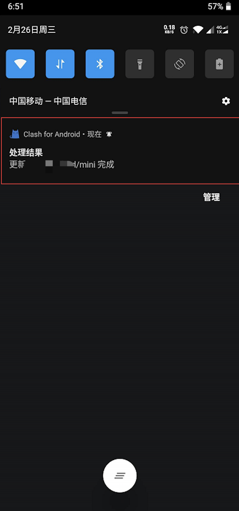

# Clash for Android


**使用此软件前** **, 需已查看**[**必备确认**](https://help.flyint.in/faq/errorfaq)\*\*\*\*



**传输加密依赖于您的设备系统时间，请确保使用的系统时间与北京时间同步\(只要年月日时分与北京时间同步即可\)**



**使用Clash时，请确认Clash是从本教程内下载的。**


## 下载安装

\*\*\*\*[**点我下载**](https://kodsky.com/#s/6_xss1CQ)\*\*\*\*

请耐心等待下载。

## 导入订阅地址

**登录网站 -&gt; 我的订阅 -&gt; 一键订阅 -&gt; 复制订阅地址**

打开Clash for Android APP 点击「配置」。

在配置界面点击「新配置」。

点击选择「从URL导入」。

名称随意填写，选择点击「URL」这里粘贴你刚才复制的订阅链接地址，并且设置自定更新间隔时间（分）推荐至少一天更新一次也就是1440秒（见下方图2），再点击右上角的保存。

在使用之前先更新配置文件，1.先勾选配置 2.点击选项 3.点击更新.如果一切正常在下拉状态栏你可以看到成功的处理结果提示（下方图2）。

回到Clash for Android主界面「点此启动」。

点击「代理」进入策略组选项，在「FLYINT飞数」策略组内可以切换节点（下方图2）

