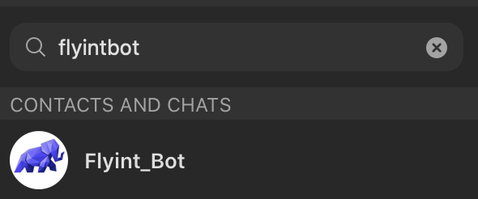
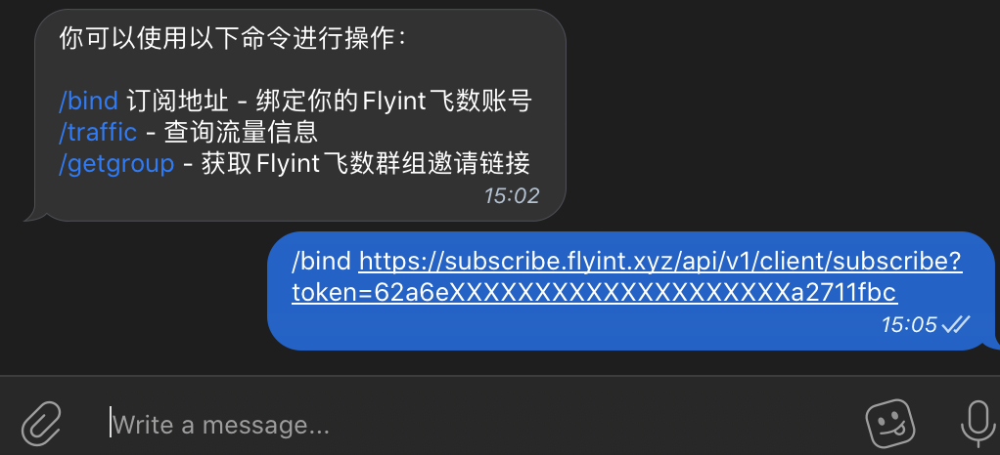
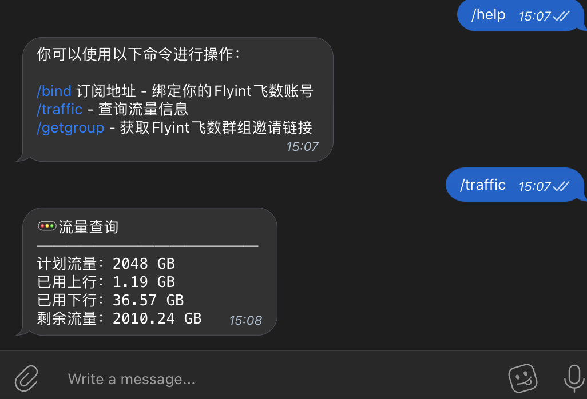

# 绑定Telegram Bot

## 绑定

在聊天列表搜索框内搜索 flyintbot

[或点此链接直接打开](https://t.me/flyintbot)

在对话框内输入并发送绑定命令

/bind空格你的订阅链接

如：

/bind https://xxx.xxxx.xxxx/api/v1/client/subscribe?token=62a6eXXXXXXXXXXXXXXXXXXXXa2711fbc

提示：绑定成功等字样时，才为绑定成功

发送 /help 获取命令帮助

发送/traffic 查询你的流量信息（统计略有延迟，请以网站显示为准）

