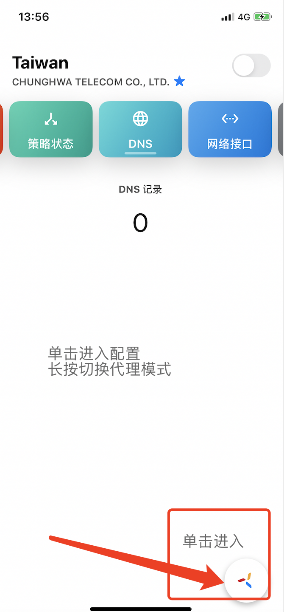
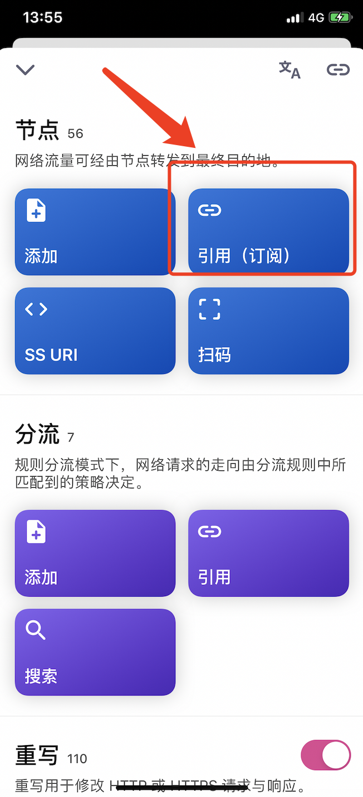
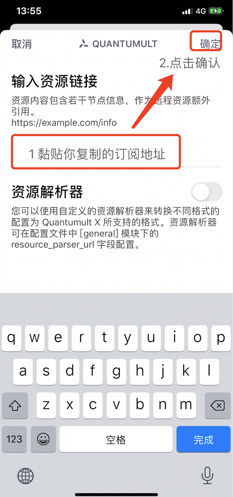
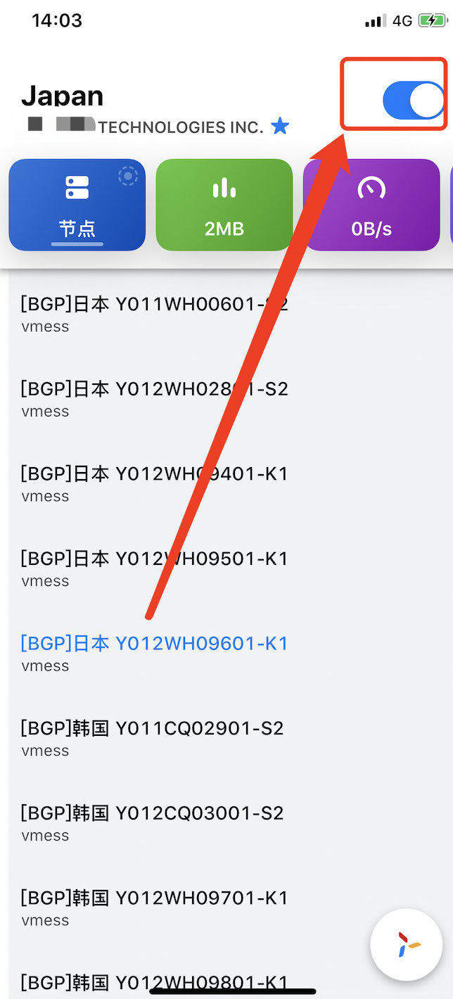

# QuantumultX


**使用此软件前** **, 需已查看**[**必备确认**](../faq/errorfaq.md)\*\*\*\*



IOS所有翻墙工具软件均收费，且仅在非中国大陆区App Store能购买下载

1. 自行登录Apple官网修改AppleID地址为非中国大陆区，并购买对应国家Apple礼品卡，进行购买下载。
2. 使用共享账号或租借他人账号。

**由于人数众多及AppleID共享安全问题，本站不提供共享及租借账号。**


## 简介

Quantumult X 是 Quantumult 作者的另一款网络代理工具。

* 界面设计更漂亮，支持目前流行的 JavaScript 脚本。
* Quantumult X 的综合体验已经不输 Surge ，性价比极高。推荐使用。
* 支持 SS/SSR，V2Ray \(不支持 KCP\) ，HTTP\(over tls\)

## 导入订阅链接

**自动导入**

**登录网站 -&gt; 我的订阅 -&gt; 一键订阅 -&gt; 导入到Quantumultx**

如未自动唤起Quantumultx 请使用手动导入。

**手动导入**

**登录网站 -&gt; 我的订阅 -&gt; 一键订阅 -&gt; 复制订阅地址**

点击 「引用\(订阅\)」

点击 「+」号，黏贴你复制的订阅地址，再点击「确认」

选择你喜爱的节点，并开启代理

