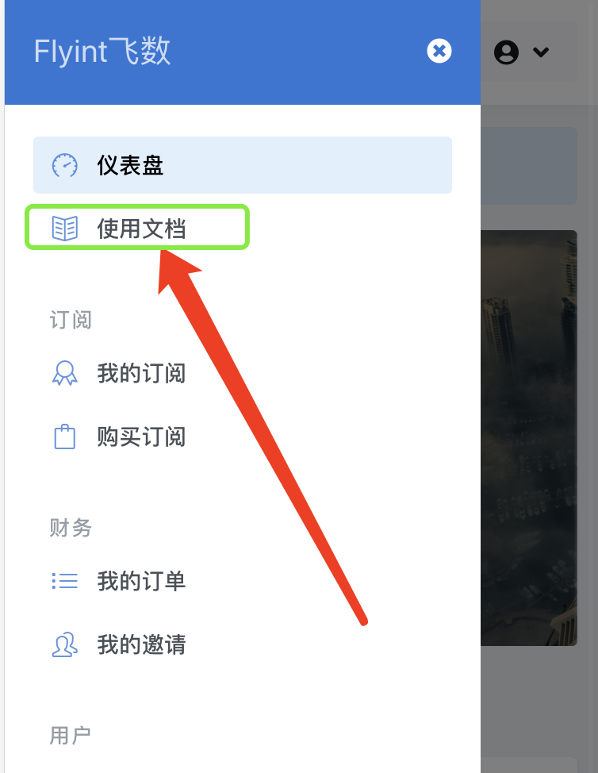
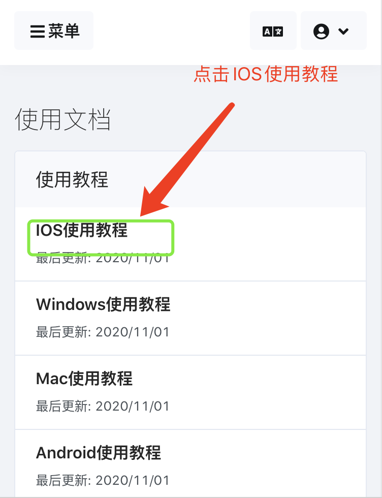
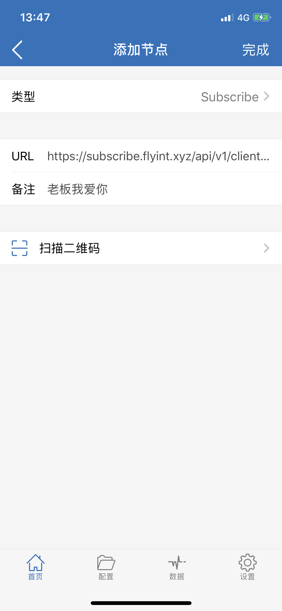
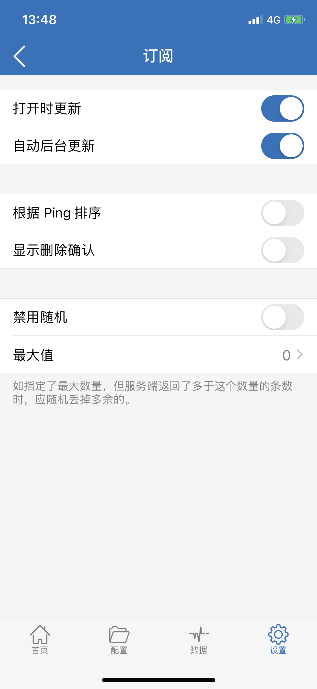
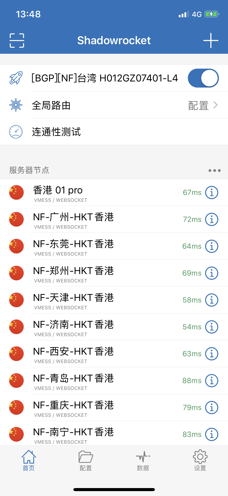

# Shadowrocket


**使用此软件前** **, 需已查看**[**必备确认**](../faq/errorfaq.md)\*\*\*\*



**传输加密依赖于您的设备系统时间，请确保使用的系统时间与北京时间同步\(只要年月日时分与北京时间同步即可\)**



IOS所有翻墙工具软件均收费，且仅在非中国大陆区App Store能购买下载

1. 自行登录Apple官网修改AppleID地址为非中国大陆区，并购买对应国家Apple礼品卡，进行购买下载。
2. 使用共享账号或租借他人账号。
3. 登录本站， 访问IOS教程 复制Shadowrocket下载账号


## 由于各种限制，中国大陆地区的APP Store内禁止上架 代理软件等。你在中国大陆区内APP Store 搜索到的各种代理软件等，不是骗人就是骗人的。当然，你钱多可以尝试一下。

_**共享下载账户仅供登录App store！ 切记不要登录iCloud! 切记不要登录iCloud! 切记不要登录iCloud! 长点脑子！！是为你好！！ 切记不要登录iCloud!！！否则你的隐私将会被泄露！！！**_

**订阅链接不是配置文件,不要导入配置里面！**

**订阅链接不是配置文件,不要导入配置里面！**

**订阅链接不是配置文件,不要导入配置里面！**

## 前提

**你需要已经注册了我们网站的账号，并且已经付费购买了套餐。**

我们的网站 [https://www.flyint.cc](https://www.flyint.cc)

访问网站进行注册并且登录，如你已经通过我们其它的客户端注册过账号，那就直接登录即可。

## 获取本站提供的App Store账户密码

登录网站 访问**使用文档**

## 退出你原来的App Store账户 并使用我们提供的下载

打开appstore &gt; 点击头像 &gt; 拉到最下面，点击退出登录  
打开appstore登录在本站复制的Apple 账号和密码

**登录后需要关闭并重新打开 App Store 否则还是显示你原来的账户**

**打开 App Store 搜索** shadowrocket 并下载

## 导入订阅链接

**订阅链接不是配置文件,不要导入配置里面！**

**订阅链接不是配置文件,不要导入配置里面！**

**订阅链接不是配置文件,不要导入配置里面！**

**自动导入**

**登录网站 -&gt; 我的订阅 -&gt; 一键订阅 -&gt; 导入到Shadowrocket**

如未自动唤起Shadowrocket 请使用手动导入。

**手动导入**

**登录网站 -&gt; 我的订阅 -&gt; 一键订阅 -&gt; 复制订阅地址**

打开 Shadowrocket 点击右上角的 + 号 添加配置，类型选择「Subscribe」，然后 URL 处粘贴你复制的订阅链接，备注随意填写，点击完成。

在 「设置\]」- 「服务器订阅」开启 「打开时更新」「自动后台更新」。

如果一切正常那么在APP首页就应该会显示出节点了，这时候就可以选择节点和启用使用了。

## 更新订阅

