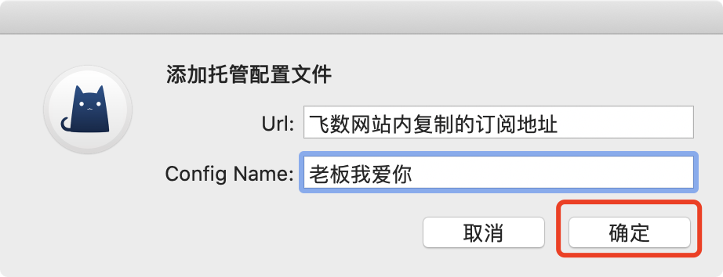
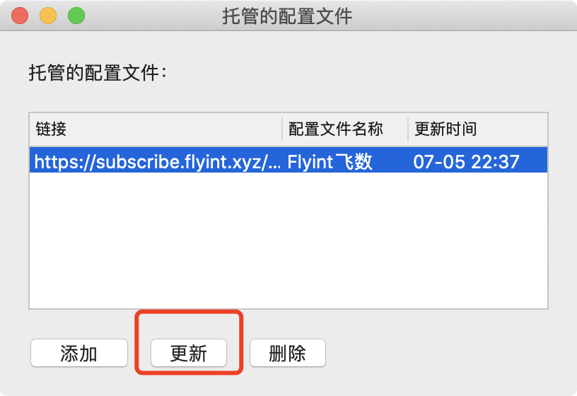
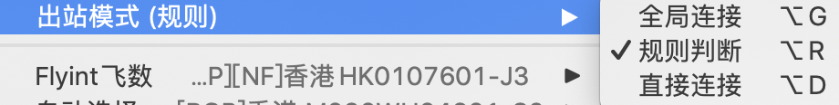

# ClashX •推荐使用


**使用此软件前** **, 需已查看**[**必备确认**](../faq/errorfaq.md)\*\*\*\*



**传输加密依赖于您的设备系统时间，请确保使用的系统时间与北京时间同步\(只要年月日时分与北京时间同步即可\)**



**使用Clash时，请确认Clash是从本教程内下载的。**


## 下载安装

[**点我下载** ](https://kodsky.com/#s/6_xuQL_A)下载完成后安装运行

请耐心等待。

## 安装

部分MAC会提示『未知开发者来源APP』等类似提示，导致无法安装。

请打开『允许任何来源』。方可进行安装

如你的MAC 『安全性与隐私』-『通用』内没有 『任何来源』选项，[请看这个开启的教程](https://jingyan.baidu.com/article/6079ad0eb99aa228ff86db0a.html)。

安装clashx

首次使用会提醒你应用来自未知开发者，选择允许打开此应用。

ClashX 首次运行会提示是否安装帮助程序。此帮助程序用于设置系统代理，否则每次你通过 ClashX 变更系统状态（打开或关闭）时都需要输入密码，点击 **「Install」** ，之后mac OS会提示输入用户密码。

**请确保你使用的系统已经同步了北京时间。如不会同步时间请**[**点此链接**](https://www.baidu.com/s?ie=utf-8&f=8&rsv_bp=1&tn=baidu&wd=mac%E5%90%8C%E6%AD%A5%E5%8C%97%E4%BA%AC%E6%97%B6%E9%97%B4)**。**

**如遇杀毒软件或防火墙等 请放行软件，或暂时关闭杀毒软件或防火墙。**

**如遇联网权限提示等，请点击确认。**

## 

## 添加订阅

### **一键导入**

**登录网站 -&gt; 我的订阅 -&gt; 一键订阅 -&gt; 导入到ClashX**

飞数支持一键自动导入ClashX, 如未自动唤醒ClashX并自动导入，请手动导入。

### **手动导入**

**登录网站 -&gt; 我的订阅 -&gt; 一键订阅 -&gt; 复制订阅地址**

1.设置为系统代理     2.打开托管配置 - &gt;管理

添加订阅地址

  **!!!!!更新订阅 请务必经常执行这一步! 及时获取同步最新节点信息!!!!**

选择代理模式

选择节点即可使用

