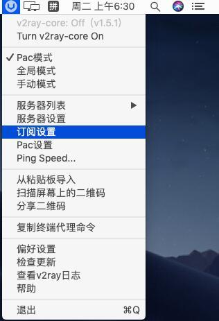
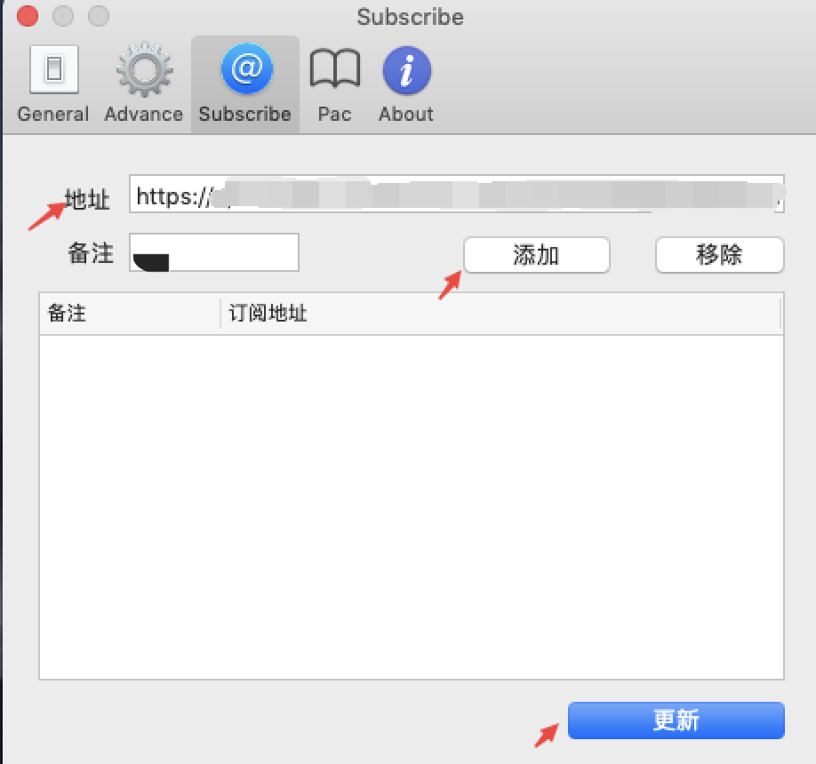
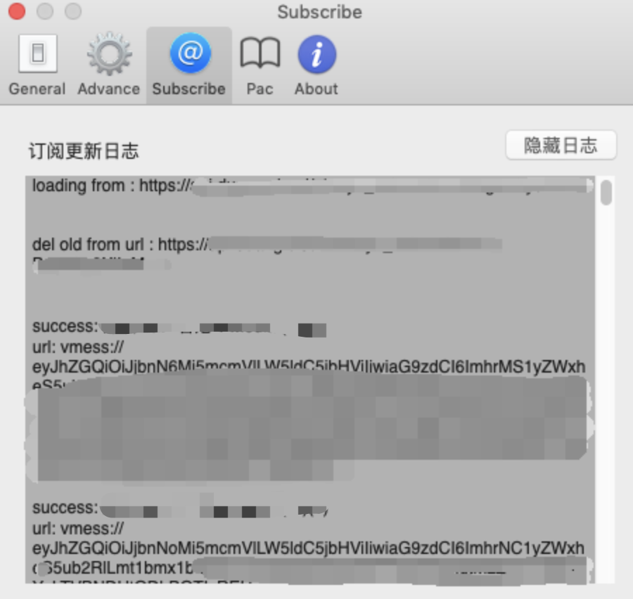
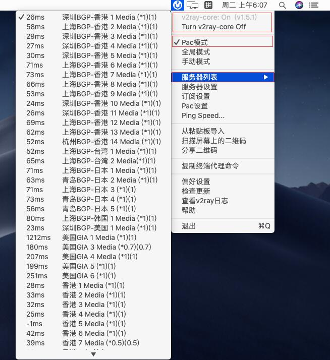
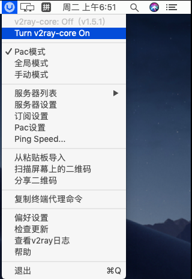

# V2rayU·不推荐


**使用此软件前** **, 需已查看**[**必备确认**](../faq/errorfaq.md)\*\*\*\*


## 下载安装

\*\*\*\*[**点我下载**](https://kodsky.com/#s/6_xuFy6A)\*\*\*\*

## 导入订阅链接

**登录网站 -&gt; 我的订阅 -&gt; 一键订阅 -&gt; 复制订阅地址**

安装并打开V2RayU，在状态栏找到V2RayU（灰色U形图标）鼠标右键点击展开其菜单找到 **「订阅设置」**并点击

在弹出的设置窗口内的 **「地址」**打码处输入刚才复制的通用订阅地址，备注可以随意填写然后依次点击 **「添加」**和 下方的 **「更新」**按钮。

如果一切正常那应该显示类似于以下界面

订阅导入节点成功后一般会自动开启代理，可以看到 **v2ray-core: on** 状态，展开V2RayU其菜单，并选择 **「Pac模式」**。在 **「服务器列表」** 中选择节点，点击 **「Ping Speed」**可以检查节点的延迟和可用性（可能会卡顿几十秒）。

关闭代理：点击 **「Turn v2ray-core Off」**可关闭代理，反之 **「Turn v2ray-core On」**可开启代理。

