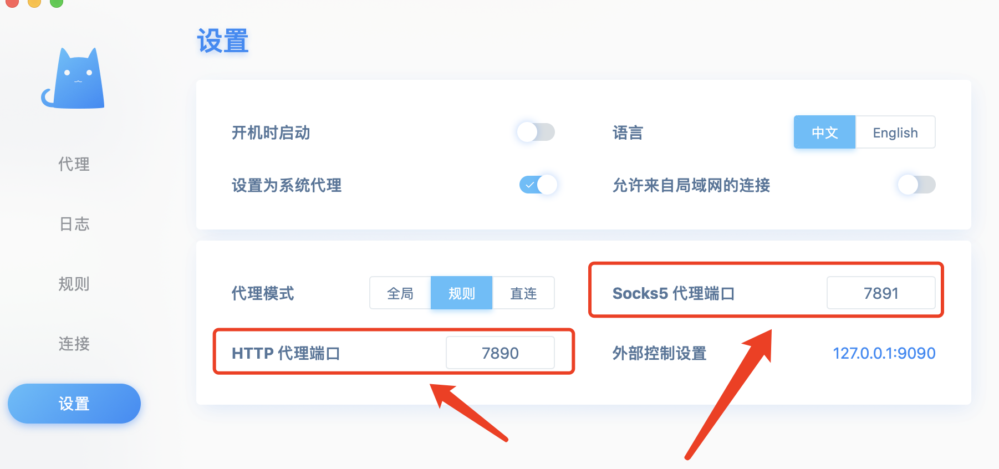
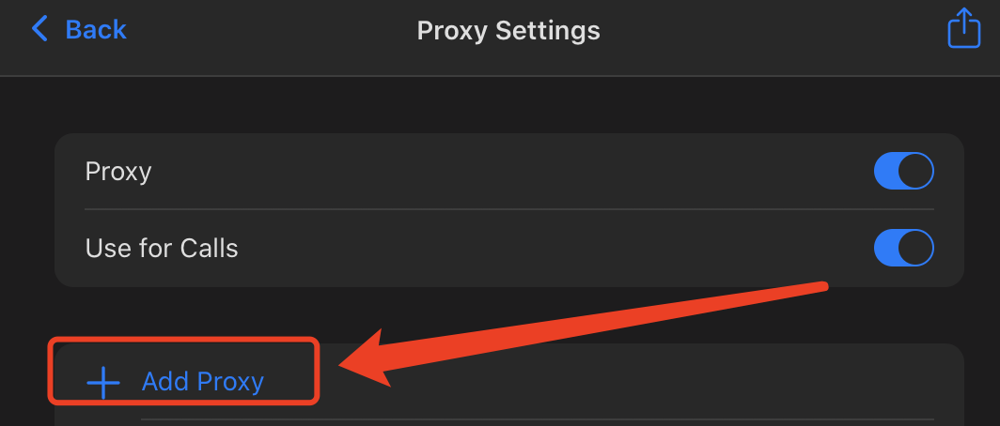
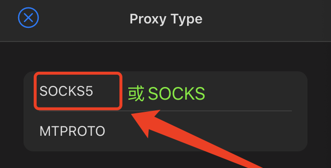
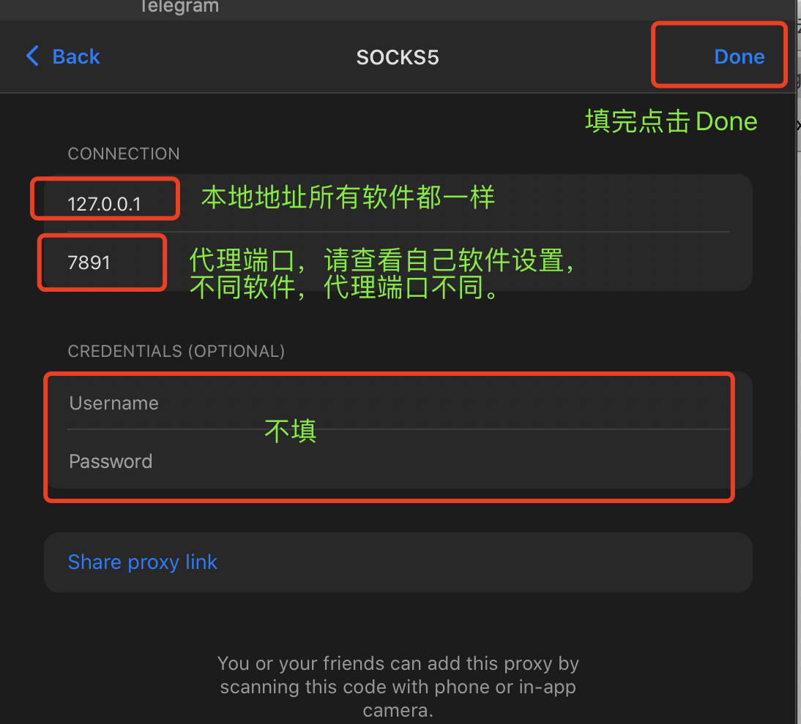
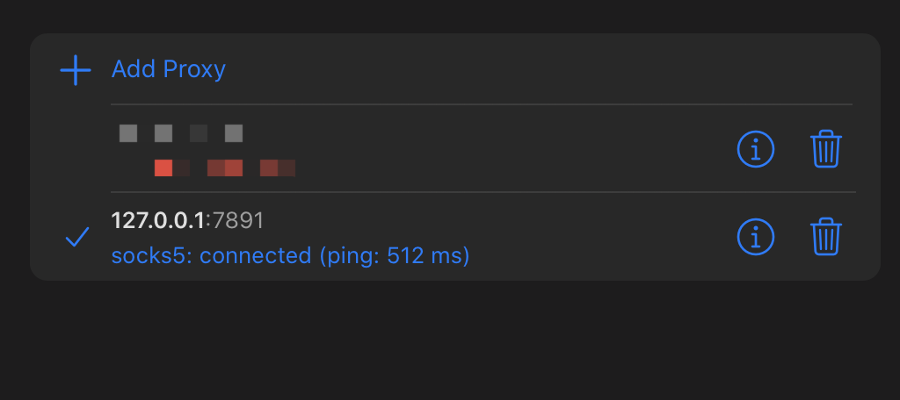

# Telegram如何设置代理

## Telegram设置代理问题

使用非全局模式时，Telegram不能联网

1. Telegram分为 Mac Windows Android IOS 四个版本 每个版本都可设置代理
2. 但不是所有版本都需要设置，请根据实际情况。

**请先确定自己成功科学联网。这里以MAC为例，其余客户端均类似。**

我使用的是 ClashX \(每个软件的本地代理端口都不一致，代理端口请查看软件设置\)

这里显示了 HTTP代理端口为7890 以及 Socks5代理端口为7891，不同软件的端口会不一样。

打开Telegram -&gt; 「Date and Storage」 -&gt; 「Use Proxy」

把 「Proxy」「Use for Calls」 打开，并点击 「Add Proxy」

选择 Socks5 （不同客户端显示不一样，但是Socks5或Socks每个客户端都会有）

由于ClashX显示的SOCKS5的端口是 7891，那代理端口就是 7891，本地地址是127.0.0.1

选择代理即可完成

