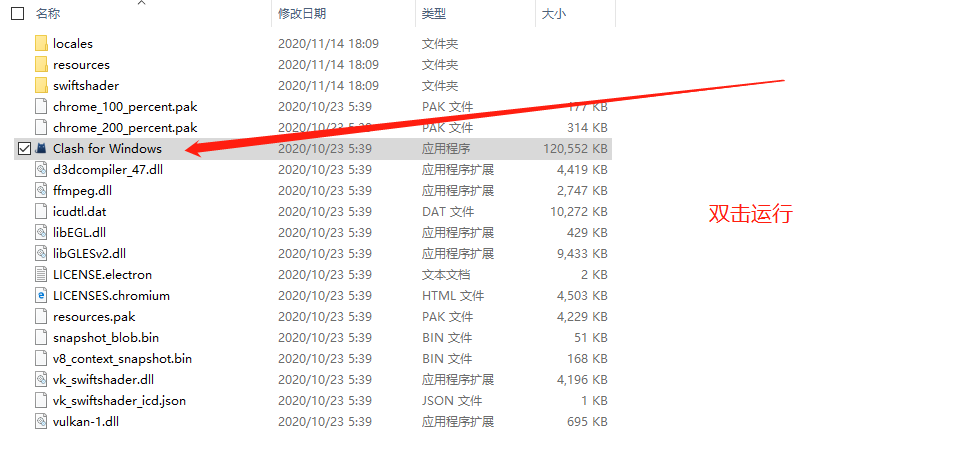
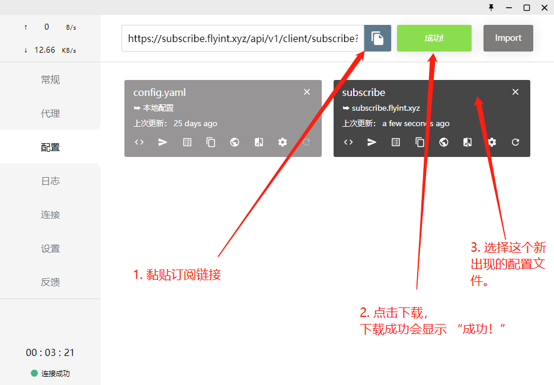
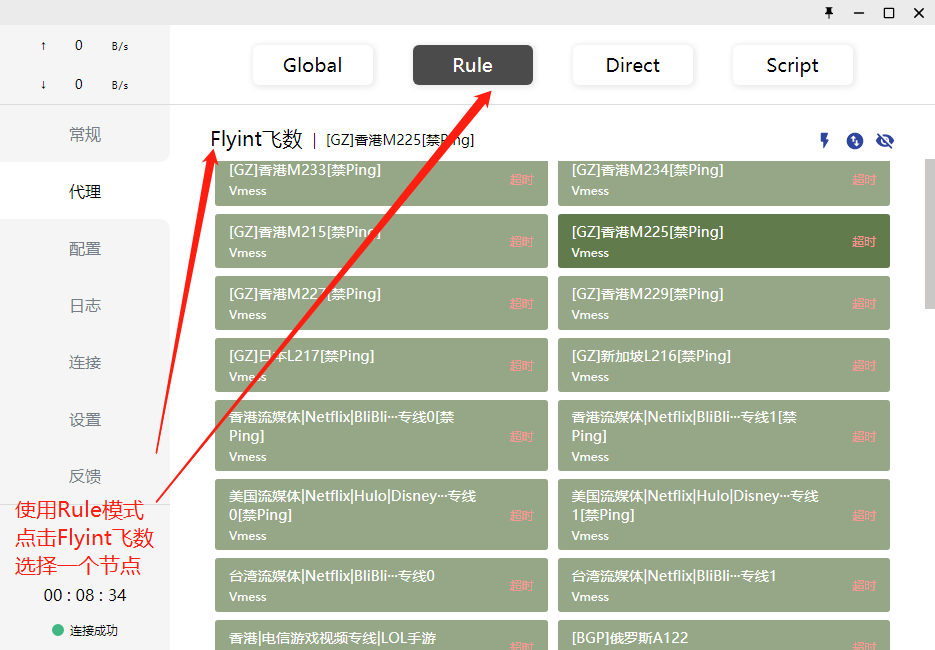
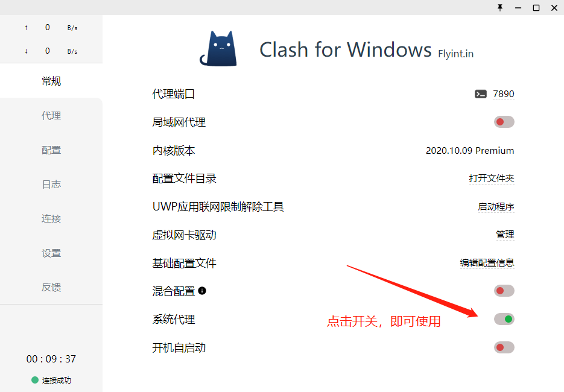
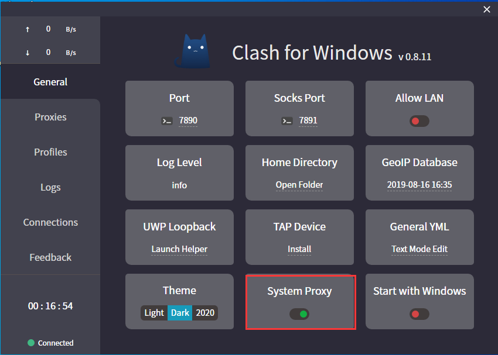

# Clash for Windows\[推荐\]


**使用此软件前** **, 需已查看**[**必备确认**](../faq/errorfaq.md)\*\*\*\*



**传输加密依赖于您的设备系统时间，请确保使用的系统时间与北京时间同步\(只要年月日时分与北京时间同步即可\)**



**使用Clash时，请确认Clash是从本教程内下载的。**

**如果您目前使用的不是Clash 我们强烈推荐你卸载!并使用Clash!**


## 警告

**数据传输过程进行加密!**

**请务必将你的系统时间同步北京时间!不能相差!不是时区同步北京!而是时间同步北京时间!**

## 简介

Clash 是一个使用 Go 语言编写，基于规则的跨平台代理软件核心程序。  
Clash for Windows 是运行在 Windows 上的一图形化 Clash 分支。通过 Clash API 来配置和控制 Clash 核心程序，便于用户可视化操作和使用。

支持 SS / VMess 协议，不支持 SSR 。

## 下载安装

**不建议使用官方版本下载**

**请**[**点击这里从本站下载**](https://kodsky.com/#s/6_x2866A)**最新汉化修正版本。**

**下载后解压, 双击 Clash for Windows.exe即可打开**

**如遇「 系统代理」无法打开，请关闭杀毒软件并以管理员模式重新打开软件即可！**

若使用 Chrome 浏览器下载 exe 文件，可能会提示不安全，请忽略此提示。

由于 Clash for Windows 没有任何有效的数字签名，

**因此 系统可能会弹出提示，请点击“更多信息”，然后选择“仍要运行”。**

## 快速上手

解压并打开Clash for Windwos

**登录网站 -&gt; 我的订阅 -&gt; 一键订阅 -&gt; 复制订阅地址**

如下图所示:

Clash for Windows 会自动拉取配置文件进行更新

如果一切顺利，你应当可以看到绿色提示信息「成功!」

**并且可以看到一个新增的配置文件, 并点击一下这个新增的配置文件**

**\*\*\*\*重要:设置自动更新配置文件时间间隔，建议设置至少12小时自动更新一次.\*\*\***

可以在左侧 「代理 」标签卡内策略组选择路由模式和切换节点

### 请务必仔细认真阅读以下操作

**「Global 」全局代理模式: 本地所有网络请求都使用节点访问.\(人话:国内外网站都使用节点访问, 除非迫不得已,请勿使用此模式!\)**

**「Rule」 根据配置文件规则分流: 根据默认规则决定哪些网站使用节点访问\(请务必使用此模式\)**

**点击左侧「代理设置」，点击展开「Flyint飞数」选择节点 即可**

**选择好节点之后在左侧「常规」标签卡开启「 系统代理」即可使用。**

**如遇「 系统代理」无法打开，请关闭杀毒软件并以管理员模式重新打开软件即可！**

## 如何手动更新订阅

## 其它无需查看的没有进阶教程:

如果你使用了 [Proxy SwitchyOmega](https://chrome.google.com/webstore/detail/proxy-switchyomega/padekgcemlokbadohgkifijomclgjgif) 插件接管了浏览器代理设置你应当设置其连接到Clash for Windows的前置代理。

#### UWP 应用 

如需使用 UWP 应用，还需要点击「EnableLoopback」来为 UWP 应用启用本地回环代理。在 Windows 10 中，微软出于安全性考虑，不允许 UWP 应用访问本地回环地址，这导致 UWP 应用无法直接使用代理，需要其他工具来破除这一限制。

Clash for Windows 集成了 EnableLoopback 程序，只需要点击「UWP Loopback」就可以使用。

#### 更多进阶设置 

见Clash for Windows开发者提供的文档：[https://docs.cfw.lbyczf.com/contents/quickstart.html](https://docs.cfw.lbyczf.com/contents/quickstart.html)

